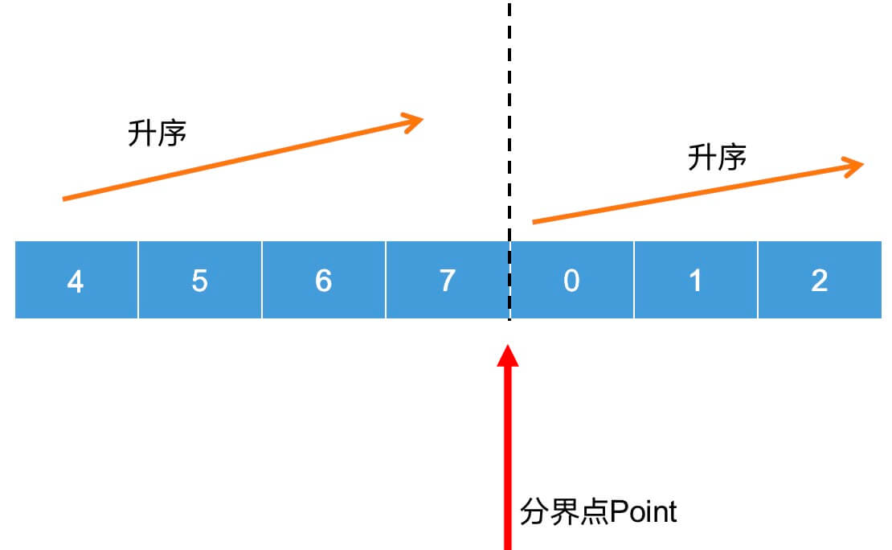

# 153. 寻找旋转排序数组中的最小值

题目：https://leetcode.cn/problems/search-in-rotated-sorted-array/description/            
题解：https://leetcode.cn/problems/search-in-rotated-sorted-array-ii/solutions/996783/cong-ji-ben-de-er-fen-fa-shuo-qi-ru-he-a-epun        


> 重点：画图 - 整体数组一共会出现两种情况， 
    >> 情况一 数组持续上升， 最小数在nums[0]
    >> 情况二 数组是两段上上升，最小数在中间到结尾 



```js
/**
 * @param {number[]} nums
 * @return {number}
 */
var findMin = function(nums) {
    let left = 0 
    let right = nums.length - 1 
    let mid = 0 
    if(nums[left] < nums[right]) return nums[0] // 情况1 - 数组还是有序的递增数组 
    while(left <= right) { // 情况2 - 有两个上升 
        mid = left + Math.floor((right-left) / 2) 
        if(nums[mid] < nums[mid - 1]) return nums[mid] // 在分界点, mid 在0 
        if(nums[mid] > nums[mid+1]) return nums[mid+1] // 在分界点, mid 在7

        // 需要注意 这里不需要判断nums[mid] = nums[0]的情况，因为不管最小数在数组中间的哪里，left/right不断向中间一定 最终都会到达分界点 
        // 
        if(nums[mid] > nums[0]) { 
            left = mid + 1 
        }else if(nums[mid] < nums[0]) {
            right = mid - 1 
        }

    }
};
```