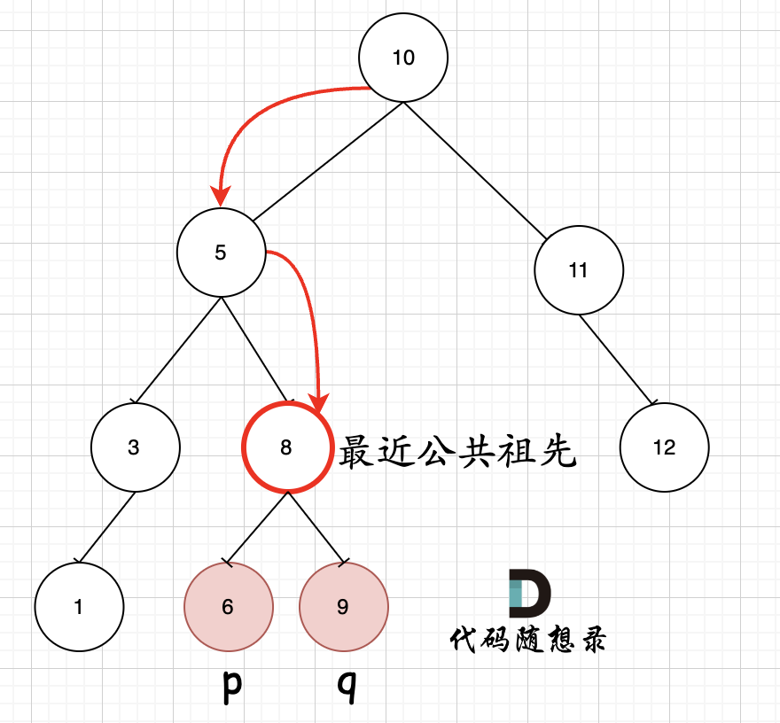

# 235. 二叉搜索树的最近公共祖先
 
题目：https://leetcode.cn/problems/lowest-common-ancestor-of-a-binary-search-tree/description/     
题解：https://programmercarl.com/0235.二叉搜索树的最近公共祖先.html#其他语言版本     


> 重点：利用二叉搜索树的性质，左子树都是小于当前节点的数字，右子树都是大于当前节点的数字
    1. 思路1: 递归 - 没有前中后序了  （感觉更贴近前序）
    2. 思路2: 迭代     

```js
/** 递归 
 * @param {TreeNode} root
 * @param {TreeNode} p
 * @param {TreeNode} q
 * @return {TreeNode}
 */
var lowestCommonAncestor = function(root, p, q) {
    if(!root){return null}
    //当前节点再pq之间，所以当前节点必然是最近公共祖先，
    //比如当前节点2，p是0，q是5. 向左遍历会错过5，向右遍历会错过0
    if((root.val <= p.val && root.val >= q.val) || (root.val >= p.val && root.val <= q.val)){
        return root
    }
    let left = null, right = null
    //因为二叉搜索树性质，左子树的值都是小鱼当前节点的
    if(p.val < root.val && q.val < root.val){
        left = lowestCommonAncestor(root.left, p, q)
        if(left){ return left}
    } 
    //
    if(p.val > root.val && q.val > root.val){
        right = lowestCommonAncestor(root.right, p, q)
        if(right){ return right}
    }
};
--------------------------------
/** 迭代 
 * @param {TreeNode} root
 * @param {TreeNode} p
 * @param {TreeNode} q
 * @return {TreeNode}
 */
var lowestCommonAncestor = function(root, p, q) {
    let queue = []
    queue.push(root)

    while(queue.length != 0){
        let cur = queue.shift()
        if((cur.val <= p.val && cur.val >= q.val) || (cur.val >= p.val && cur.val <= q.val)){
            return cur
        }
        if(p.val < cur.val && q.val < cur.val){
            queue.push(cur.left)
        } 
        if(p.val > cur.val && q.val > cur.val){
            queue.push(cur.right)
        }
    }
    
    

};
----------------------------------
/**
 * @param {TreeNode} root
 * @param {TreeNode} p
 * @param {TreeNode} q
 * @return {TreeNode}
 */
var lowestCommonAncestor = function(root, p, q) {

    let cur = root;
    while (cur) {
        if ((cur.val <= p.val && cur.val >= q.val) || (cur.val >= p.val && cur.val <= q.val)) {
            return cur;
        }
        if (cur.val > p.val && cur.val > q.val) {
            cur = cur.left
        }
        if (cur.val < p.val && cur.val < q.val) {
            cur = cur.right
        }
    }
};
```