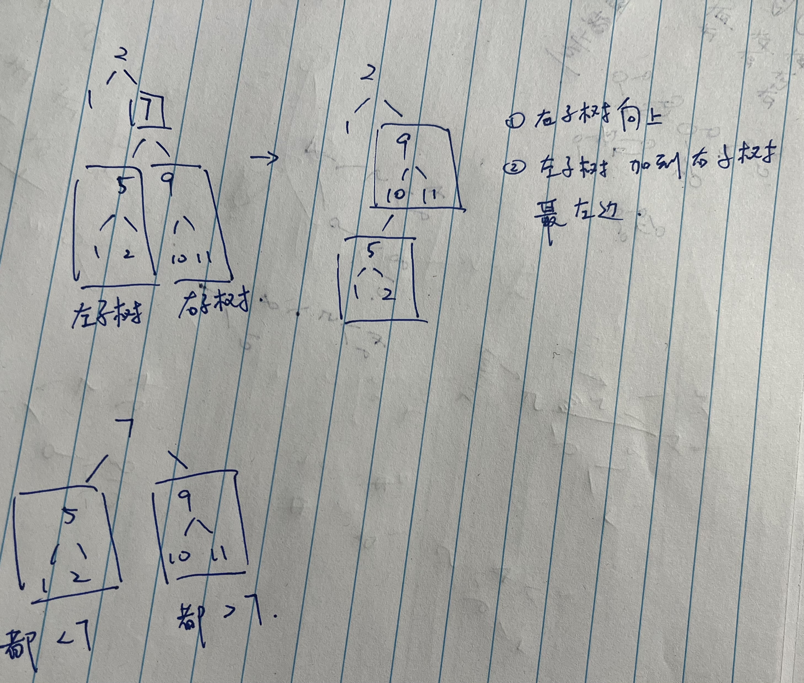

# 450. 删除二叉搜索树中的节点

题目：https://leetcode.cn/problems/delete-node-in-a-bst/description/        
题解：https://programmercarl.com/0450.删除二叉搜索树中的节点.html#思路      


> 重点：注意使用递归前序 - 分治，不要使用traverse 直接处理tree。  迭代也可以做    


```js
/** 注意使用递归前序 - 分治
 * @param {TreeNode} root
 * @param {number} key
 * @return {TreeNode}
 */
let parent = null 
var deleteNode = function(root, key) {
    if(!root){return null}
    if(root.val == key){
        if(root.left && root.right){
            let p = root.right
            while(p.left){ p = p.left}
            p.left = root.left
            return root.right
        } 
        
        if(root.left){return root.left}
        
        if(root.right){ return root.right}
        
        if(!root.left && !root.right){return null}
    }
    
    parent = root
    if(key < root.val){
        root.left = deleteNode(root.left, key)
    }
    if(key > root.val){
        root.right = deleteNode(root.right, key)
    }
    return root

};
```
