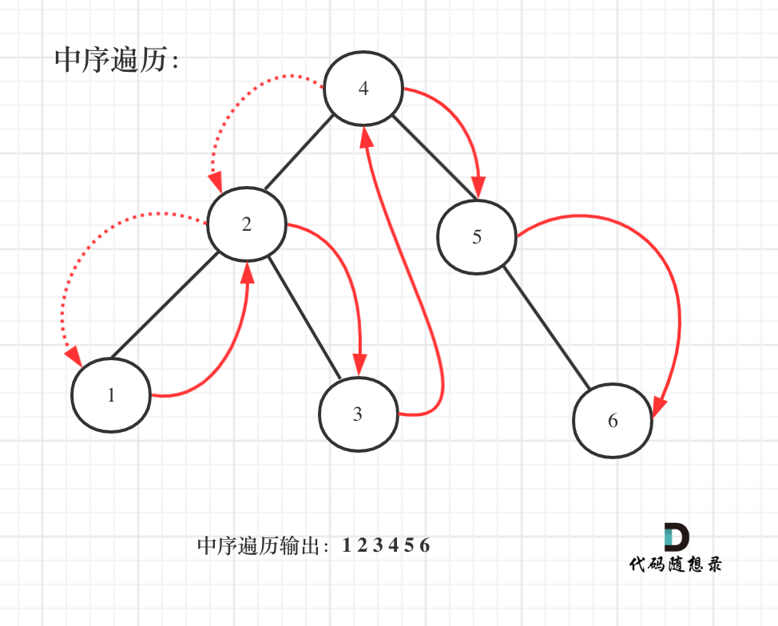

# 98.验证二叉搜索树

题目：https://leetcode.cn/problems/validate-binary-search-tree/submissions/     
题解：https://programmercarl.com/0098.%E9%AA%8C%E8%AF%81%E4%BA%8C%E5%8F%89%E6%90%9C%E7%B4%A2%E6%A0%91.html#%E7%AE%97%E6%B3%95%E5%85%AC%E5%BC%80%E8%AF%BE       


> 重点：
    1. 利用 + 理解中序 = 左 中 右      
    2. 解法1 - 递归 - 中序 - 利用在二叉搜索树中，中序遍历会是单调递增的             
    3. 解法2 - 递归 - 中序 - 利用中序左中右的顺序，利用指针拿到上一个节点的信息         
    4. 解法3 - 迭代 - 还没看懂      


```js
/** 解法1 - 递归 - 中序 - 利用在二叉搜索树中，中序遍历会是单调递增的   
 * @param {TreeNode} root
 * @return {boolean}
 */
var isValidBST = function(root) {


    function traverse(root){
        if(!root){return}
        traverse(root.left)
        res.push(root.val)
        traverse(root.right)


    }
    let res = []
    traverse(root)
    for(let i = 1; i<res.length; i++){
        if(res[i] <= res[i-1]){ return false}
    }
    return true
};
---------------------------------------
/** 解法2 - 递归 - 中序 - 利用中序左中右的顺序，利用指针拿到上一个节点的信息         
 * @param {TreeNode} root
 * @return {boolean}
 */
var isValidBST = function(root) {

    function helper(root){
        if(!root){return true}

        let left = helper(root.left)
        if(pre != null && pre.val >= root.val){
            return false
        }   
        pre = root
        let right = helper(root.right)

        return left && right
    }

    let pre = null 
    return helper(root)
};
---------------------------------------
// 还没看懂 
let pre = null;
var isValidBST = function (root) {
	const queue = [];
	let cur = root;
	let pre = null;
	while (cur !== null || queue.length !== 0) {
		if (cur !== null) {
			queue.push(cur);
			cur = cur.left;
		} else {
			cur = queue.pop();
			if (pre !== null && cur.val <= pre.val) {
				return false;
			}
			pre = cur;
			cur = cur.right;
		}
	}
	return true;
};
```


