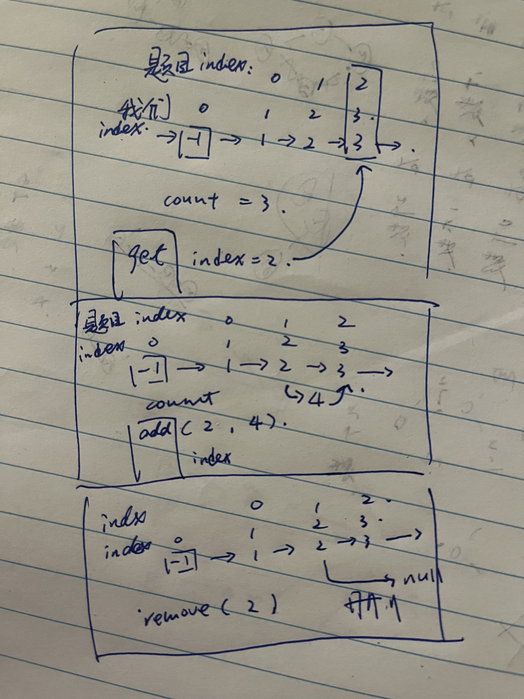

# 707. 设计链表
题目： https://leetcode.cn/problems/design-linked-list/description/

题解： https://programmercarl.com/0707.设计链表.html#算法公开课

>重点: 利用虚拟头节点。同时注意区分虚拟头节点的index和题目中的index



```js
    class ListNode{
        constructor(val, next){
            this.val = val
            this.next = next 
        }
    }

    var MyLinkedList = function() {
        this.head = new ListNode(-1, null)
        this.count = 0 
    };

    /** 
     * @param {number} index
     * @return {number}
     */
    MyLinkedList.prototype.get = function(index) {
        if(index <0 || index >= this.count){
            return -1 
        }
        let cur = this.head
        for(let i=0; i<index+1; i++){
            cur = cur.next 
        }
        return cur.val
    };

    /** 
     * @param {number} val
     * @return {void}
     */
    MyLinkedList.prototype.addAtHead = function(val) {
        this.addAtIndex(0, val)
    };

    /** 
     * @param {number} val
     * @return {void}
     */
    MyLinkedList.prototype.addAtTail = function(val) {
        this.addAtIndex(this.count, val)
    };

    /** 
     * @param {number} index 
     * @param {number} val
     * @return {void}
     */
    MyLinkedList.prototype.addAtIndex = function(index, val) {
        if(index > this.count){
            return 
        }
        let cur = this.head 
        for(let i=0; i<index; i++){
            cur = cur.next 
        }
        let tmp = cur.next 
        cur.next = new ListNode(val, tmp)
        this.count ++ 
        // this.print()
    };


    /** 
     * @param {number} index
     * @return {void}
     */
    MyLinkedList.prototype.deleteAtIndex = function(index) {
        if(index <0 || index >= this.count){
            return 
        }
        let cur = this.head 
        for(let i=0; i<index; i++){
            cur = cur.next 
        }
        cur.next = cur.next.next 
        this.count --
        // this.print()

    };

    MyLinkedList.prototype.print = function() {
        let cur = this.head 
        while(cur){
            console.log(cur.val, '->')
            cur = cur.next 
        }
    };


    /**
     * Your MyLinkedList object will be instantiated and called as such:
     * var obj = new MyLinkedList()
     * var param_1 = obj.get(index)
     * obj.addAtHead(val)
     * obj.addAtTail(val)
     * obj.addAtIndex(index,val)
     * obj.deleteAtIndex(index)
     */
```