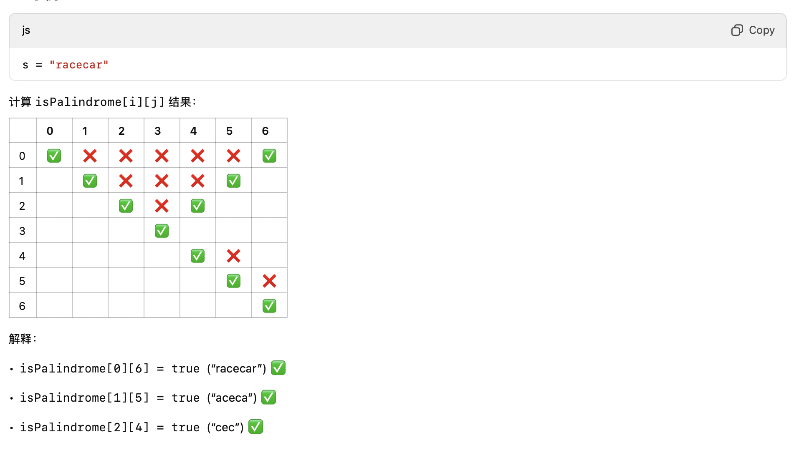

# 132. 分割回文串 II

题目：https://leetcode.cn/problems/palindrome-partitioning-ii/solutions/642188/132-fen-ge-hui-wen-chuan-iidong-tai-gui-3hqva/?envType=daily-question&envId=2025-03-02                
题解：https://programmercarl.com/0132.分割回文串II.html#思路              

> 重点： 没搞明白 ！！！！



```js
    /**
 * @param {string} s
 * @return {number}
 */
var minCut = function(s) {
    let n = s.length;
    if (n <= 1) return 0;

    // 1. 预处理 isPalindrome[i][j]，表示 s[i:j+1] 是否是回文
    let isPalindrome = new Array(n).fill(false).map(() => new Array(n).fill(false));

    for (let right = 0; right < n; right++) {
        for (let left = 0; left <= right; left++) {
            if (s[left] === s[right] && (right - left <= 2 || isPalindrome[left + 1][right - 1])) {
                isPalindrome[left][right] = true;
            }
        }
    }
    

    // 2. dp[i] 表示 s[0:i] 的最小切割次数
    let dp = new Array(n).fill(0).map((_, i) => i); // 初始化最大值 i (最坏情况下每个字符都切割)

    for (let i = 1; i < n; i++) {
        if (isPalindrome[0][i]) {
            dp[i] = 0; // 整个 s[0:i] 是回文，不需要切割
        } else {
            for (let j = 0; j < i; j++) {
                if (isPalindrome[j + 1][i]) {
                    dp[i] = Math.min(dp[i], dp[j] + 1);
                }
            }
        }
    }

    return dp[n - 1];
};
```