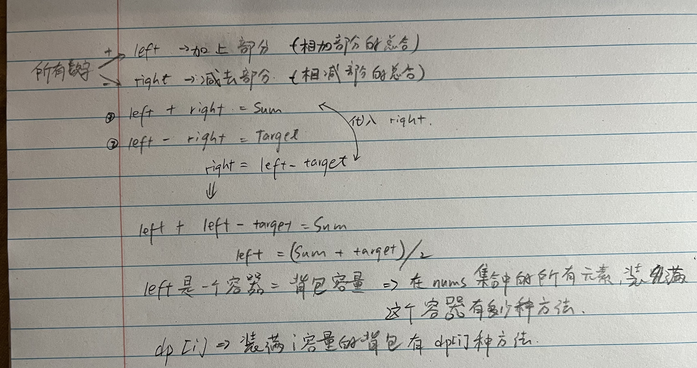

# 494. 目标和 

题目：https://leetcode.cn/problems/target-sum/description/    
题解：https://programmercarl.com/0494.目标和.html#思路    



> 重点: 把问题转换成01背包问题     


```js
/**
 * @param {number[]} nums
 * @param {number} target
 * @return {number}
 */
var findTargetSumWays = function(nums, target) {
    let sum = nums.reduce((pre, cur) => pre + cur)
    let tmp = target + sum
    if (tmp % 2 == 1 ) return 0
    if(Math.abs(target) > sum) return 0
    let left = tmp / 2

    let dp = new Array(left + 1).fill(0)
    dp[0] = 1

    for(let i = 0; i < nums.length; i++){ // 物品 
        for(let j = left; j >= nums[i]; j--){ // 背包容量 
            dp[j] += dp[j - nums[i]]
        }
    }

    return dp[left]
};
```