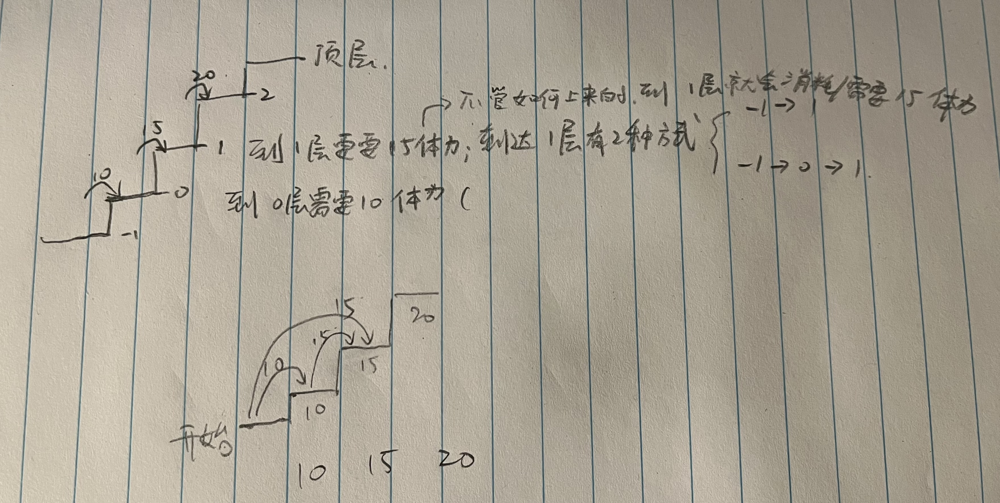

# 746. 使用最小花费爬楼梯

题目：https://leetcode.cn/problems/min-cost-climbing-stairs/description/        
题解：https://www.programmercarl.com/0746.使用最小花费爬楼梯.html#算法公开课       



> 重点：        
    1. 我对cost的理解是，跳到i需要消耗cost[i]的体力                  
    2. dp中存储的是跳到i需要的最少体力               
    3. dp[0] 跳到0需要小 cost[0] 的体力       
    4. 我们是从 -1 层开始的         
    5. dp[1] 到达1有两种方式                  
        -> 方法1：从-1跳到1 = 需要消到达cost0的最少体力 + 需要cost[1]的体力         
        -> 方法2：从-1直接跳到1 = 需要cost[1]的体力        
    6. 到达顶层是需要消耗0 体力的          


```js
/**
 * @param {number[]} cost
 * @return {number}
 */
var minCostClimbingStairs = function(cost) {
    // 跳到0 需要消耗 cost[0]的体力
    // dp[i] 跳到i需要的最少体力
    cost.push(0) // 到达顶层需要的消耗 0 体力 
    let dp = new Array(cost.length)
    dp[0] = cost[0]
    dp[1] = Math.min(cost[0]+cost[1], cost[1])
    
    for(let i = 2; i < dp.length; i++){
        // 到达i层的两种方式
        // 方式1: 从 i-2层跳上来。需要体力 = 到达i-2层的体力 + 到i层的体力
        // 方式2: 从 i-1层跳上来。需要体力 = 到达i-1层的体力 + 到i层的体力
        dp[i] = Math.min(dp[i-2], dp[i-1]) + cost[i] 
    }
    return dp[dp.length-1]
};
------------------
/** 代码随想录 - dp[i]的定义：到达第i台阶所花费的最少体力为dp[i]。
 * @param {number[]} cost
 * @return {number}
 */
var minCostClimbingStairs = function(cost) {
  const dp = [0, 0]
  for (let i = 2; i <= cost.length; ++i) {
    dp[i] = Math.min(dp[i - 1] + cost[i - 1], dp[i - 2] + cost[i - 2])
  }
  return dp[cost.length]
};
```