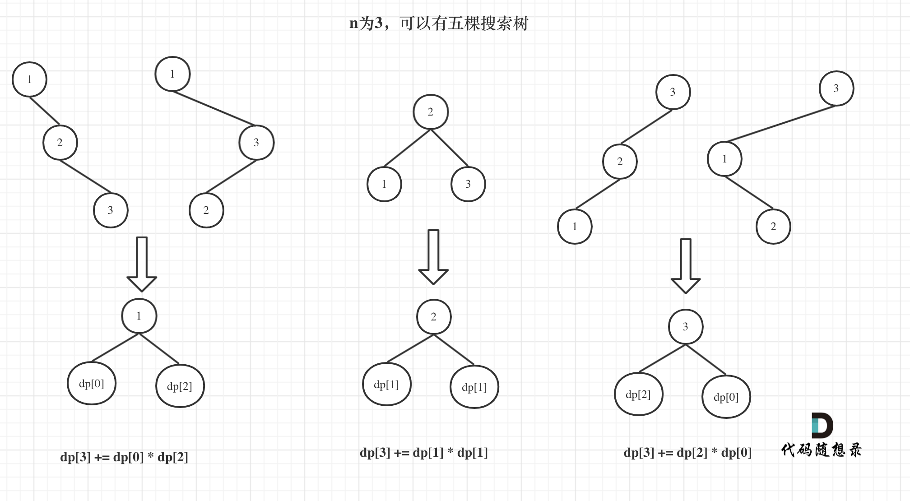

# 96. 不同的二叉搜索树 

题目：https://leetcode.cn/problems/unique-binary-search-trees/description/     
题解：https://programmercarl.com/0096.不同的二叉搜索树.html      




> 重点：

    dp[3] = 元素1为头结点搜索树的数量 + 元素2为头结点搜索树的数量 + 元素3为头结点搜索树的数量    

    元素1为头结点搜索树的数量 = 右子树有2个元素的搜索树数量 * 左子树有0个元素的搜索树数量        
    元素2为头结点搜索树的数量 = 右子树有1个元素的搜索树数量 * 左子树有1个元素的搜索树数量       
    元素3为头结点搜索树的数量 = 右子树有0个元素的搜索树数量 * 左子树有2个元素的搜索树数量

    有2个元素的搜索树数量就是dp[2]。    
    有1个元素的搜索树数量就是dp[1]。      
    有0个元素的搜索树数量就是dp[0]。      

    所以dp[3] = dp[2] * dp[0] + dp[1] * dp[1] + dp[0] * dp[2]       

```js
/**
 * @param {number} n
 * @return {number}
 */
// dp[i] 存的 i 的二叉树有多少种 
// 当 i = 3 时，二叉树的个数 = 头是1的二叉树的个数 + 头是2的二叉树的个数 + 头是3的二叉树的个数
// dp[3] = dp[0]*dp[2] + dp[1]*dp[1] + dp[2]*dp[0]
// dp[0]*dp[2] 是 1 为头的情况，左边有0个node，右边有2个node 
// dp[1]*dp[1] 是 2 为头的情况 ，左边有1个node，右边有1个node 
// dp[2]*dp[0] 是 3 为头的情况 ，左边有2个node，右边有0个node 
var numTrees = function(n) {
    let dp = new Array(n+1).fill(0)
    dp[0] = 1
    dp[1] = 1
    dp[2] = 2
    for(let i = 3; i < dp.length; i++){
        let res = 0 
        for(let j = 0; j < i; j++){
            res = dp[j] * dp[i-j-1] + res 
        }
        dp[i] = res
    }
    return dp[n]
};
```
