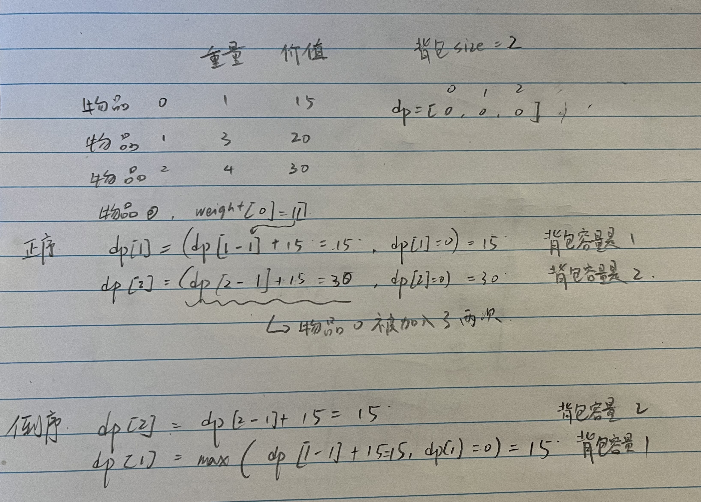

# 背包

> 背包问题只需要搞懂 01背包 和 完全背包。
    
### 01背包 
> 什么是01背包？ = n 个物品，每个物品只有一个。有一个只容量为m的背包，求解将哪些物品装入背包里物品价值总和最大。

#### 01 背包 - 二维数组解法
    https://programmercarl.com/背包理论基础01背包-1.html#算法公开课       
    https://www.bilibili.com/video/BV1pY4y1J7na/?spm_id_from=333.788.recommend_more_video.0&vd_source=dbb06dab62cf39e6f7017ff59f8c2cfc

    ### 数据 
        物品重量 - weight = []        
        物品价值 - value = []         
        背包容量 - m      

    ### dp含义
        dp[i][j] = 表示从下标为[0-i]的物品里任意取，放进容量为j的背包，价值总和最大是多少。
        i 是 0 到 i 的物品       
        j 是背包容量               
        
    ### 转移方程
        dp[i][j] = max(dp[i - 1][j], dp[i - 1][j - weight[i]] + value[i]) 
        每次遇到一个物品只有两个选项：    
            1. 不放物品i ==> dp[i - 1][j]         
            2. 放物品i ==> dp[i - 1][j - weight[i]] + value[i]; 这里[j - weight[i]]是表示找到之前容量j - weight[i]的背包的结果。再加上当前物品i的价值，就是最终的价值！    

    ### 初始化 
        横向第一排和纵向第一列需要初始化，因为dp是从左斜上方得来的 

    ### 遍历顺序 
        先遍历物品还是背包都可以，顺序正序倒序都可以。因为当前数据是通过上一层和左上方数据得来的。上下层数据是完全分开的。

```js
    function testSizeBagProblem (size, value, bagSize) {
        let len = size.length;
        let dp = new Array(len).fill(0).map( () => new Array(bagSize + 1).fill(0))
        for(let i = 1; i < bagSize+1; i++){ dp[0][i] = value[0]}

        for (let i = 1; i < len; i++){ // 物品 
            for (let j = 0; j <= bagSize; j++){ // 背包容量 
                if (j < size[i]) {
                    dp[i][j] = dp[i - 1][j];
                }else{
                    dp[i][j] = Math.max(dp[i-1][j], dp[i-1][j-size[i]] + value[i])
                }
            }
        }
        console.table(dp)
        return dp[len-1][bagSize]
    }

    function test () {
        console.log(testSizeBagProblem([1, 3, 4, 5], [15, 20, 30, 55], 6));
    }

    test();
```


### 01 背包 - 一维数组解法
    https://programmercarl.com/背包理论基础01背包-2.html        
    一维数组解法就是把二维数组的结构压缩成了一维数组，每次只刷新当前一行。

    ### 数据 
        物品重量 - weight = []        
        物品价值 - value = []         
        背包容量 - m      

    ### dp含义
        dp[j] = 表示容量为j的背包，价值总和最大是多少。
        j 是背包容量               
        
    ### 转移方程
        dp[j] = max(dp[j], dp[j - weight[i]] + value[i]) 
        每次遇到一个物品只有两个选项：    
            1. 不放物品i ==> dp[j]    （因为当前位置就是上一层的结果）
            2. 放物品i ==> dp[j - weight[i]] + value[i]; 

    ### 初始化 - 重点！！！！
        bag size 0 1 2 3 
        index    0 1 2 3 
        dp       0 0 0 0
        index = 0 时，dp 初始化是0，很好理解。 背包容量是0，肯定是无法放东西进去，所以最大价值肯定也是0. 
        index 非 0 时，dp 初始化也是0。因为转移方程是通过当前位置和之前的结果取最大得到的。当前位置数值过大，会导致无法更新数值。

    ### 遍历顺序 - 重点！！！！
        一定要先遍历物品在遍历背包，因为一维dp是二维压缩的结果。一维数组每个index是背包的容量。
        使用倒序 -> 为了保证每个物品只被添加一次，不会被重复添加。


        
```js
function testWeightBagProblem(wight, value, size) {
  const len = wight.length, 
    dp = Array(size + 1).fill(0);
  for(let i = 1; i <= len; i++) { // 物品 
    for(let j = size; j >= wight[i - 1]; j--) { // 背包
      dp[j] = Math.max(dp[j], value[i - 1] + dp[j - wight[i - 1]]);
    //   if(j < wight[i - 1]) { 这样写更容易理解
    //         dp[j] = dp[j];  
    //     }else if(j >= wight[i - 1]) {
    //       dp[j] = Math.max(dp[j], value[i - 1] + dp[j - wight[i - 1]]);
    //     }
    }
  }
  return dp[size];
}


function test () {
  console.log(testWeightBagProblem([1, 3, 4, 5], [15, 20, 30, 55], 6));
}

test();
```


