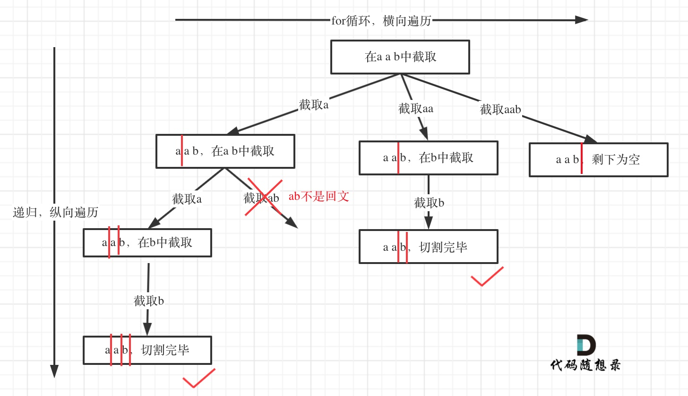

# 131. 分割回文串 

题目：https://leetcode.cn/problems/palindrome-partitioning/description/    
题解：https://programmercarl.com/0131.分割回文串.html#优化    

> 重点：画出来树结构，可以优化回文检查（暂时没理解）



```js
/**
 * @param {string} s
 * @return {string[][]}
 */
var partition = function(s) {
    //检查是否是回文 
    function check(arr){
        let left = 0, right = arr.length-1
        while(left < right){
            if(arr[left] != arr[right]){return false}
            left++
            right--
        }
        return true
    }

    // resting 记录是剩下还有什么
    function helper(pathLen, resting){
        if(pathLen == s.length){
            res.push([...path])
            return 
        }

        for(let i = 1; i <= resting.length; i++){
            let cur = resting.slice(0, i)
            if(check(cur)){ 
                path.push(cur)
                pathLen = pathLen + cur.length
                helper(pathLen, resting.slice(i))
                path.pop()
                pathLen = pathLen - cur.length
            }else{
                continue
            }
        }
    }

    path = []
    res = []
    pathLen = 0 //记录当前path的总长度，已经走了多少了 
    helper(0, s)
    return res 

};
---------------------------
/** 传递index 省略slice操作 
 * @param {string} s
 * @return {string[][]}
 */
var partition = function(s) {

    function check(l, r){
        let left = l, right = r
        while(left < right){
            if(s[left] != s[right]){return false}
            left++
            right--
        }
        return true
    }

    function helper(pathLen, startIndex){
        if(pathLen == s.length){
            res.push([...path])
            return 
        }

        for(let i = startIndex; i < s.length; i++){
            let cur = s.slice(startIndex, i+1)
            if(check(startIndex, i)){ 
                path.push(cur)
                pathLen = pathLen + cur.length
                helper(pathLen, i+1)
                path.pop()
                pathLen = pathLen - cur.length
            }else{
                continue
            }
        }


    }

    path = []
    res = []
    pathLen = 0 
    helper(0, 0)
    return res 

};
```