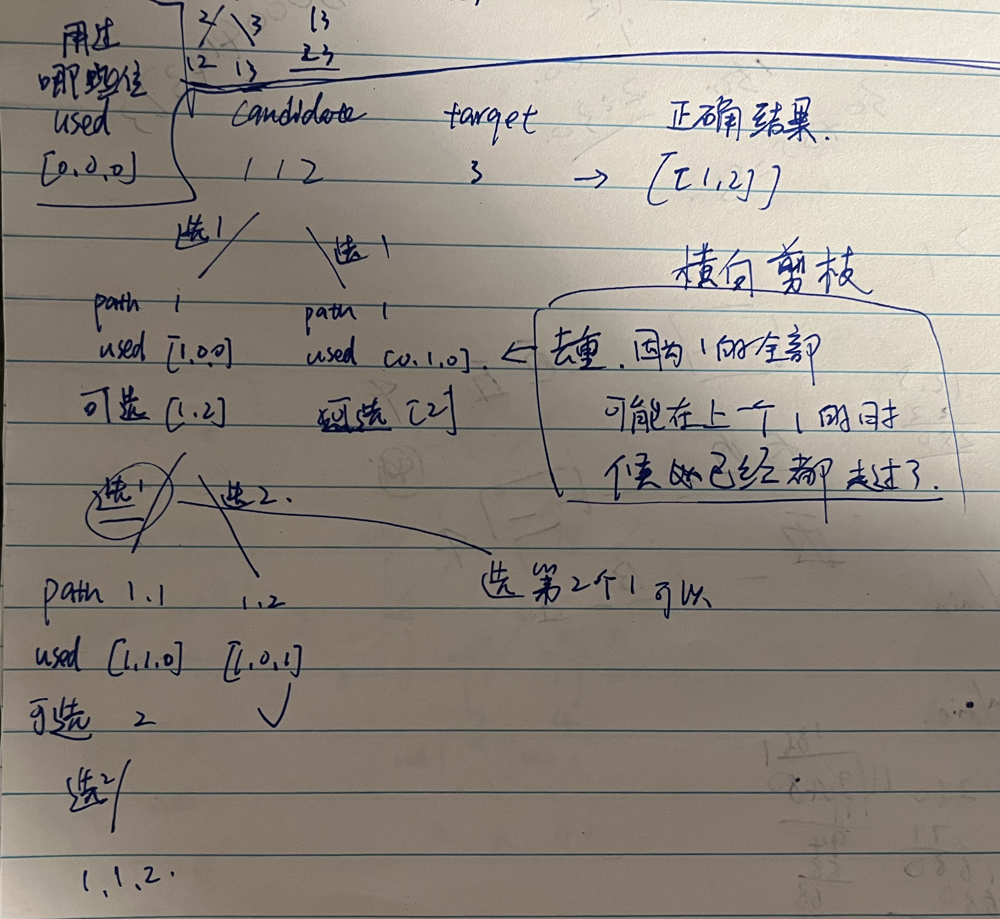

# 40. 组合总和 II

题目：https://leetcode.cn/problems/combination-sum-ii/description/    
题解：https://programmercarl.com/0040.组合总和II.html#其他语言版本    


> 重点：          
    去重逻辑 = 前后比较 `candidates[i] == candidates[i-1] ` + used记录            
    1. 单一的使用 `candidates[i] == candidates[i-1]` ，不使用used 会导致向下遍历时，丢失数据。    
    2. 使用 used 数组来记录使用，可以做到横向去重复     
    3. candidates[i] == candidates[i-1] -> true + used[i-1] -> true = 向下递归，有两个相同的数据，这两个数据都可以使用        
    4. candidates[i] == candidates[i-1] -> true + used[i-1] -> false = 横向遍历，当前数据和上一个数据一致，因为上一个数据的结果已经都做过一遍了，所以可以直接跳过当前数。





```js
/**
 * @param {number[]} candidates
 * @param {number} target
 * @return {number[][]}
 */
var combinationSum2 = function(candidates, target) {

    function helper(startIndex){
        if(curSum == target){
            res.push([...cur])
            return 
        }

        for(let i = startIndex; i< candidates.length; i++){
            if(i>0 && candidates[i] == candidates[i-1] && used[i-1]==false){ continue}
            if(candidates[i] > target || curSum + candidates[i] > target){return}
            cur.push(candidates[i])
            curSum += candidates[i]
            used[i] = true
            helper(i+1)
            cur.pop()
            curSum -= candidates[i]
            used[i] = false
        }
    }

    let res = []
    let cur = []
    let curSum = 0
    candidates.sort((a,b) => a-b)
    let used = new Array(candidates.length).fill(false)
    helper(0)
    return res 

};
```