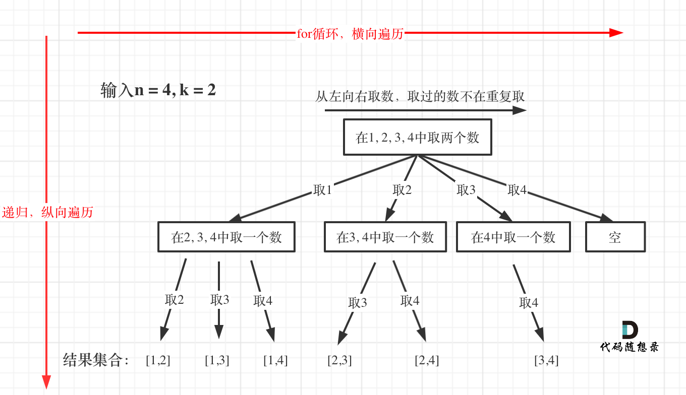

# 77. 组合 

题目：https://leetcode.cn/problems/combinations/description/       
题解：https://programmercarl.com/0077.组合.html#剪枝优化     




> 重点：for loop 横向遍历，递归 纵向遍历           


```js
/**
 * @param {number} n
 * @param {number} k
 * @return {number[][]}
 */
var combine = function(n, k) {

    function helper(start ,curRes){
        
        if(curRes.length == k){
            res.push([...curRes])
        }

        for(let i = start; i<= n; i++){
            curRes.push(i)
            helper(i + 1, curRes)
            curRes.pop()
        }
    }

    let res = []
    helper(1, [])
    return res 
};
----------------------
/** 剪枝操作 
 * @param {number} n
 * @param {number} k
 * @return {number[][]}
 */
var combine = function(n, k) {

    function helper(start){
        
        if(curPath.length == k){
            res.push([...curPath])
        }

        for(let i = start; i<= n; i++){
            // k = 目标长度, n = 4 (总共是 1，2，3，4 可以用)
            //假设现在遍历到2了（1的选择已经全部走完了） ， curPath = []
            // 那我们剩余的可以选的数字个数是 n - 2 = 2 （还剩下 3和4 可以选）
            // 假如 resting + curPath.length + 1 < k 说明就算把3和4都选上 总长度也不能达到 k的要求，所以就不需要继续遍历了。 
            //这里的 1 是代表把2本身，因为现在curPath本身是空 
            let resting = n - i 
            if(resting + curPath.length + 1< k){return}
            curPath.push(i)
            helper(i + 1)
            curPath.pop()
        }
    }

    let res = []
    let curPath = []
    helper(1)
    return res 
};
```