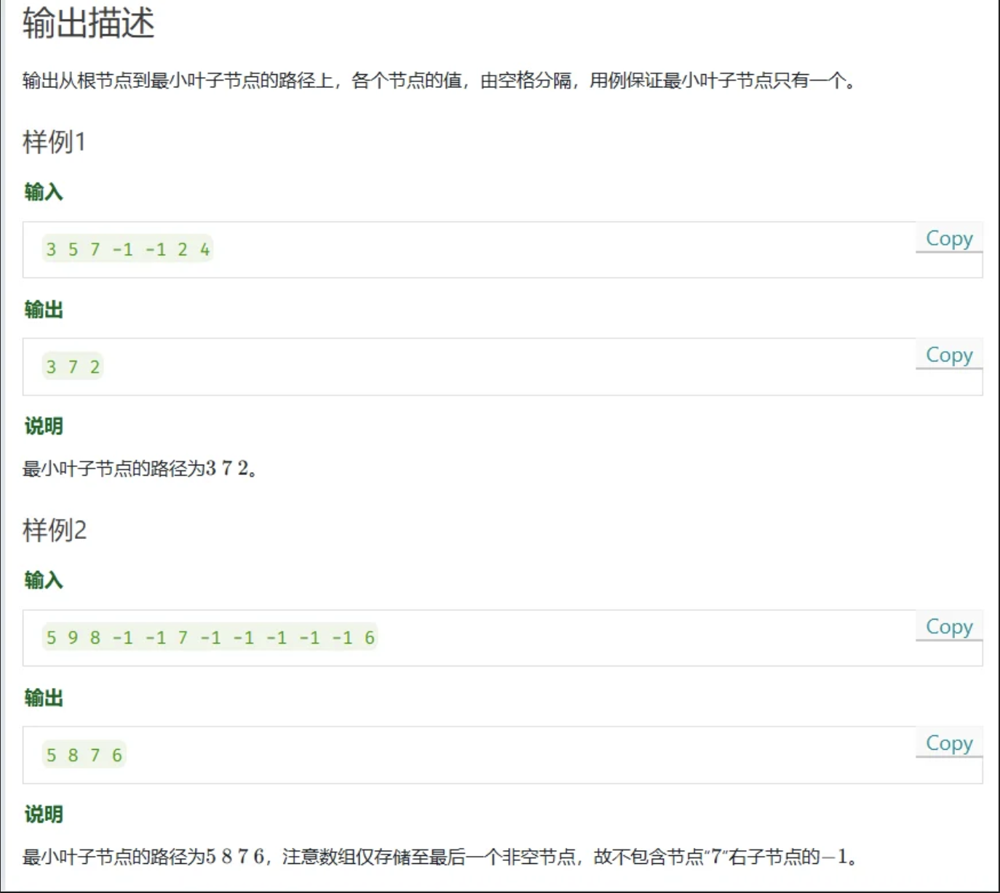

# 华为od - 回溯 - 数组二叉树




> 思路：回溯 

```js

    function findPath(arr){
  
        function backtracking(index){
            if( (2*index > arr.length) || (arr[2*index] == -1 && arr[2*index+1] == -1)){
            if(res.length == 0) {
                res = [...curPath]
            }else{
                if(res[res.length-1] > curPath[curPath.length-1]){
                res = [...curPath]
                }
            }
            }

            if(2*index < arr.length && arr[2*index] != -1) {
            curPath.push(arr[2*index])
            backtracking(2*index)
            curPath.pop()
            }

            if(2*index+1 < arr.length && arr[2*index+1] != -1) {
            curPath.push(arr[2*index+1])
            backtracking(2*index+1)
            curPath.pop()
            }

        }

        arr.unshift(0)
        let curPath = [arr[1]]
        let res = []
        backtracking(1)
        console.log(res)
    }

    let arr = [5,9,8,-1,-1,7,-1,-1,-1,-1,-1,6]

    findPath(arr)

```