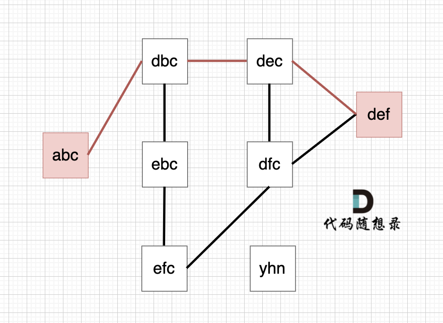

# 110. 字符串接龙
https://www.programmercarl.com/kamacoder/0110.字符串接龙.html#思路     
https://leetcode.cn/problems/word-ladder/  
  
> 整体思路：        
        1. bfs的解，一定是最短路径。  
        2. 每个字母都是一下，看看是否对        



```js       
// bfc  
/**
 * @param {string} beginWord
 * @param {string} endWord
 * @param {string[]} wordList
 * @return {number}
 */
var ladderLength = function(beginWord, endWord, wordList) {
    let queue = []
    queue.push([beginWord, 1])
    let visited = new Map() // 记录走过的路 以免出现转圈 
    let wordSet = new Set(wordList)
    if(!wordSet.has(endWord)) return 0 
    while(queue.length != 0){
        let cur = queue.shift()
        let path = cur[1]
        let curWord = cur[0]
        for(let i = 0; i < curWord.length; i++){
            let curWordArr = curWord.split('')
            // console.log(curWordArr, '----')
            for(let w = 0; w < 26; w++){
                curWordArr[i] = String.fromCharCode('a'.charCodeAt() + w)
                // console.log(curWordArr)
                if(curWordArr.join('') == endWord) return path + 1 
                
                if(wordSet.has(curWordArr.join('')) && !visited.has(curWordArr.join('') )){
                    visited.set(curWordArr.join(''), true )
                    queue.push([curWordArr.join(''), path+1])
                }
            }
        }
    }
    return 0 
};
```