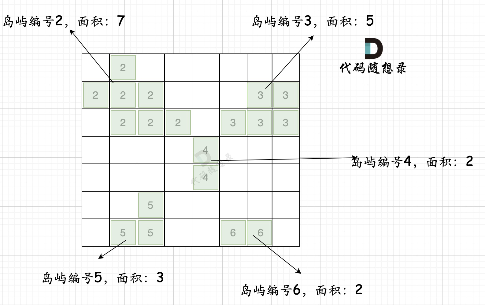

# 827. 最大人工岛
https://leetcode.cn/problems/making-a-large-island/description/  
https://www.programmercarl.com/kamacoder/0104.建造最大岛屿.html#优化思路   
  
> 整体思路：        
        1. 标记不同的island，每个island都有一个id。   
        2. 遍历所有的海水节点，看他的上下左右，是否有island，有的话就记录面积。        



```js       
// dfs 
/**
 * @param {number[][]} grid
 * @return {number}
 */
var largestIsland = function(grid) {

    function dfs(r, c){
        for(let d of directions){
            let nextR = r + d[0]
            let nextC = c + d[1]

            if(nextC < 0 || nextR < 0 || nextC >= cols || nextR >= rows) continue 

            if(!visited[nextR][nextC] && grid[nextR][nextC] == 1){
                grid[nextR][nextC] = id 
                count ++ 
                dfs(nextR, nextC)
            }

        }
    }

    let count = 0 
    let rows = grid.length 
    let cols = grid[0].length 
    let mapArea = new Map()
    let id = 2 
    let directions = [[0, 1], [0, -1], [1, 0], [-1, 0]]
    let visited = new Array(rows).fill(0).map(() => new Array(cols).fill(false))
    let fullLand = true  
    for(let r = 0; r < rows; r++){
        for(let c = 0; c < cols; c++){
            if(grid[r][c] == 1){
                count = 1 
                grid[r][c] = id
                dfs(r, c)
                mapArea.set(id, count) // 标记不同的island，每个island都有一个id。
                id ++ 
            }else if(grid[r][c] == 0){
                fullLand = false 
            }
        }
    }
    if(fullLand) return rows*cols

    let res = 0 
    for(let r = 0; r < rows; r++){
        for(let c = 0; c < cols; c++){ // 检查上下左右是否有island
            if(grid[r][c] == 0){
                count = 1 
                let visitedMap = new Map() // 记录已经添加的island，以免重复
                for(let d of directions){
                    let nextR = r + d[0]
                    let nextC = c + d[1]

                    if(nextC < 0 || nextR < 0 || nextC >= cols || nextR >= rows) continue 
                    if(grid[nextR][nextC] == 0) {
                        // console.log('enter1', nextR, nextC)
                        continue 
                    } 
                    
                    let curId = grid[nextR][nextC]
                    // console.log(curId,visitedMap)
                    if(visitedMap.has(curId)) {
                        // console.log('enter2', nextR, nextC)
                        continue
                    } 
                    // console.log(curId, mapArea.get(curId) )
                    count = count + mapArea.get(curId)   
                    visitedMap.set(curId, true)   
                }
                // console.log('-----------------', count)
                res = Math.max(count, res)
            }
        }
    }
    // console.table(grid)
    // console.log(mapArea)
    return res 
};
```