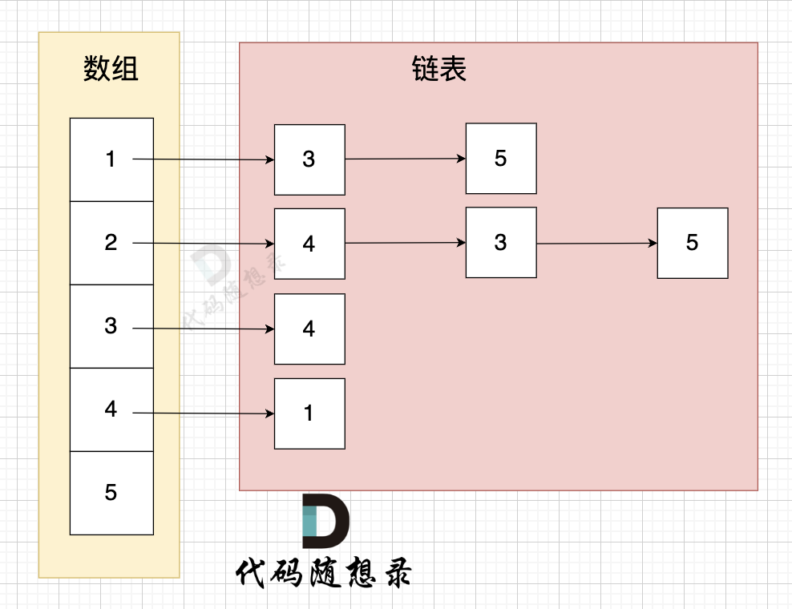

# 图论基础

1. 图论-数据存储结构   
    > 邻接矩阵 = 二维数组 = grid[2][5] = 6，表示 节点 2 连接 节点5 为有向图，节点2 指向 节点5，边的权值为6

    > 邻接表 = 数组+链表 
    
2. dfs 深度优先搜索    
    回溯就是深度优先搜索的实现 
    ```js
    void dfs(参数) {
        if (终止条件) {
            存放结果;
            return;
        }

        for (选择：本节点所连接的其他节点) {
            处理节点;
            dfs(图，选择的节点); // 递归
            回溯，撤销处理结果
        }
    }
    ````
3. bfs - 广度优先搜索
    ```js
        let queue = [节点]
        while(queue.length != 0){
            let cur = queue.shift()
            for (选择：本节点所连接的其他节点) {
                    处理节点;
                    queue.push(节点)
                    回溯，撤销处理结果
            }
        }
    ```
4. 体型 - 岛屿 ｜ 有向图 ｜ 无向图